```mermaid
erDiagram

    DIM_DATE {
        int date_key PK
        date full_date
        int day_of_month
        int day_of_week
        string day_name
        int week_of_year
        int month_number
        string month_name
        int quarter_number
        int year_number
        boolean is_weekend
        boolean is_month_end
    }

    DIM_CUSTOMER {
        bigint customer_key PK
        string customer_id UK
        string first_name
        string last_name
        string gender
        date date_of_birth
        string segment
        string risk_band
        string occupation
        string nationality
        string marital_status
        string customer_status
        datetime effective_from
        datetime effective_to
        boolean is_current
    }

    DIM_ACCOUNT {
        bigint account_key PK
        string account_id UK
        string account_number
        string account_type
        string product_code
        string currency_code
        date opened_date
        date closed_date
        string account_status
        decimal interest_rate
        string branch_code
        datetime effective_from
        datetime effective_to
        boolean is_current
    }

    DIM_PRODUCT {
        bigint product_key PK
        string product_code UK
        string product_name
        string product_family
        string product_category
        string product_subcategory
        string balance_sheet_type
        string interest_type
        string fee_model
        boolean is_active
    }

    DIM_BRANCH {
        bigint branch_key PK
        string branch_code UK
        string branch_name
        string region_name
        string province_name
        string country_name
        string channel_type
        string branch_status
    }

    DIM_CHANNEL {
        bigint channel_key PK
        string channel_code UK
        string channel_name
        string channel_group
        string assisted_flag
        string digital_flag
    }

    DIM_EMPLOYEE {
        bigint employee_key PK
        string employee_id UK
        string employee_name
        string job_title
        string department_name
        string manager_name
        string employee_status
        string cost_center
    }

    DIM_CURRENCY {
        int currency_key PK
        string currency_code UK
        string currency_name
        string symbol
        int decimal_places
    }

    DIM_GEOGRAPHY {
        bigint geography_key PK
        string country_code
        string country_name
        string province_state
        string city_name
        string postal_code
        string region_group
    }

    DIM_GL_ACCOUNT {
        bigint gl_account_key PK
        string gl_account_code UK
        string gl_account_name
        string gl_category
        string gl_subcategory
        string financial_statement_line
        string account_nature
    }

    DIM_TRANSACTION_TYPE {
        bigint transaction_type_key PK
        string transaction_type_code UK
        string transaction_type_name
        string transaction_group
        string debit_credit_indicator
        string fee_flag
        string reversal_flag
    }

    DIM_LOAN {
        bigint loan_key PK
        string loan_id UK
        string loan_type
        decimal approved_amount
        decimal interest_rate
        int term_months
        string collateral_type
        string repayment_frequency
        string loan_status
        date disbursement_date
        date maturity_date
    }

    DIM_CARD {
        bigint card_key PK
        string card_id UK
        string card_number_masked
        string card_type
        string network
        string card_status
        date issue_date
        date expiry_date
    }

    DIM_CAMPAIGN {
        bigint campaign_key PK
        string campaign_id UK
        string campaign_name
        string campaign_type
        string start_date
        string end_date
        string offer_type
        string campaign_status
    }

    DIM_BATCH {
        bigint batch_key PK
        string batch_id UK
        datetime load_start_ts
        datetime load_end_ts
        string source_system
        string pipeline_name
        string batch_status
        int records_loaded
        int records_rejected
    }

    BRIDGE_CUSTOMER_ACCOUNT {
        bigint customer_key FK
        bigint account_key FK
        string relationship_type
        decimal ownership_percentage
        datetime effective_from
        datetime effective_to
        boolean is_current
    }

    FACT_TRANSACTION {
        bigint transaction_fact_key PK
        bigint transaction_id UK
        int transaction_date_key FK
        bigint customer_key FK
        bigint account_key FK
        bigint product_key FK
        bigint branch_key FK
        bigint channel_key FK
        bigint currency_key FK
        bigint transaction_type_key FK
        bigint batch_key FK
        decimal transaction_amount
        decimal local_amount
        decimal fee_amount
        decimal tax_amount
        decimal exchange_rate
        int transaction_count
    }

    FACT_ACCOUNT_BALANCE_DAILY {
        bigint balance_fact_key PK
        int date_key FK
        bigint customer_key FK
        bigint account_key FK
        bigint product_key FK
        bigint branch_key FK
        bigint currency_key FK
        bigint batch_key FK
        decimal opening_balance
        decimal closing_balance
        decimal average_balance
        decimal debit_turnover
        decimal credit_turnover
    }

    FACT_LOAN_SNAPSHOT_MONTHLY {
        bigint loan_snapshot_fact_key PK
        int date_key FK
        bigint customer_key FK
        bigint account_key FK
        bigint loan_key FK
        bigint product_key FK
        bigint branch_key FK
        bigint currency_key FK
        bigint batch_key FK
        decimal principal_outstanding
        decimal interest_outstanding
        decimal arrears_amount
        decimal provision_amount
        int days_past_due
    }

    FACT_CARD_TRANSACTION {
        bigint card_transaction_fact_key PK
        bigint card_transaction_id UK
        int transaction_date_key FK
        bigint customer_key FK
        bigint account_key FK
        bigint card_key FK
        bigint merchant_geography_key FK
        bigint channel_key FK
        bigint currency_key FK
        bigint transaction_type_key FK
        bigint batch_key FK
        decimal transaction_amount
        decimal fee_amount
        decimal cashback_amount
        int transaction_count
    }

    FACT_CUSTOMER_INTERACTION {
        bigint interaction_fact_key PK
        bigint interaction_id UK
        int interaction_date_key FK
        bigint customer_key FK
        bigint employee_key FK
        bigint channel_key FK
        bigint campaign_key FK
        bigint branch_key FK
        bigint batch_key FK
        string interaction_type
        string interaction_outcome
        int interaction_count
        int response_flag
    }

    FACT_GL_POSTING {
        bigint gl_posting_fact_key PK
        bigint posting_id UK
        int posting_date_key FK
        bigint gl_account_key FK
        bigint branch_key FK
        bigint currency_key FK
        bigint product_key FK
        bigint batch_key FK
        decimal debit_amount
        decimal credit_amount
        decimal net_amount
        int posting_count
    }

    FACT_CUSTOMER_PRODUCT_HOLDING {
        bigint holding_fact_key PK
        int date_key FK
        bigint customer_key FK
        bigint product_key FK
        bigint branch_key FK
        bigint batch_key FK
        int active_account_count
        int active_loan_count
        int active_card_count
        decimal total_balance
        decimal total_exposure
    }

    DIM_DATE ||--o{ FACT_TRANSACTION : transaction_date_key
    DIM_CUSTOMER ||--o{ FACT_TRANSACTION : customer_key
    DIM_ACCOUNT ||--o{ FACT_TRANSACTION : account_key
    DIM_PRODUCT ||--o{ FACT_TRANSACTION : product_key
    DIM_BRANCH ||--o{ FACT_TRANSACTION : branch_key
    DIM_CHANNEL ||--o{ FACT_TRANSACTION : channel_key
    DIM_CURRENCY ||--o{ FACT_TRANSACTION : currency_key
    DIM_TRANSACTION_TYPE ||--o{ FACT_TRANSACTION : transaction_type_key
    DIM_BATCH ||--o{ FACT_TRANSACTION : batch_key

    DIM_DATE ||--o{ FACT_ACCOUNT_BALANCE_DAILY : date_key
    DIM_CUSTOMER ||--o{ FACT_ACCOUNT_BALANCE_DAILY : customer_key
    DIM_ACCOUNT ||--o{ FACT_ACCOUNT_BALANCE_DAILY : account_key
    DIM_PRODUCT ||--o{ FACT_ACCOUNT_BALANCE_DAILY : product_key
    DIM_BRANCH ||--o{ FACT_ACCOUNT_BALANCE_DAILY : branch_key
    DIM_CURRENCY ||--o{ FACT_ACCOUNT_BALANCE_DAILY : currency_key
    DIM_BATCH ||--o{ FACT_ACCOUNT_BALANCE_DAILY : batch_key

    DIM_DATE ||--o{ FACT_LOAN_SNAPSHOT_MONTHLY : date_key
    DIM_CUSTOMER ||--o{ FACT_LOAN_SNAPSHOT_MONTHLY : customer_key
    DIM_ACCOUNT ||--o{ FACT_LOAN_SNAPSHOT_MONTHLY : account_key
    DIM_LOAN ||--o{ FACT_LOAN_SNAPSHOT_MONTHLY : loan_key
    DIM_PRODUCT ||--o{ FACT_LOAN_SNAPSHOT_MONTHLY : product_key
    DIM_BRANCH ||--o{ FACT_LOAN_SNAPSHOT_MONTHLY : branch_key
    DIM_CURRENCY ||--o{ FACT_LOAN_SNAPSHOT_MONTHLY : currency_key
    DIM_BATCH ||--o{ FACT_LOAN_SNAPSHOT_MONTHLY : batch_key

    DIM_DATE ||--o{ FACT_CARD_TRANSACTION : transaction_date_key
    DIM_CUSTOMER ||--o{ FACT_CARD_TRANSACTION : customer_key
    DIM_ACCOUNT ||--o{ FACT_CARD_TRANSACTION : account_key
    DIM_CARD ||--o{ FACT_CARD_TRANSACTION : card_key
    DIM_GEOGRAPHY ||--o{ FACT_CARD_TRANSACTION : merchant_geography_key
    DIM_CHANNEL ||--o{ FACT_CARD_TRANSACTION : channel_key
    DIM_CURRENCY ||--o{ FACT_CARD_TRANSACTION : currency_key
    DIM_TRANSACTION_TYPE ||--o{ FACT_CARD_TRANSACTION : transaction_type_key
    DIM_BATCH ||--o{ FACT_CARD_TRANSACTION : batch_key

    DIM_DATE ||--o{ FACT_CUSTOMER_INTERACTION : interaction_date_key
    DIM_CUSTOMER ||--o{ FACT_CUSTOMER_INTERACTION : customer_key
    DIM_EMPLOYEE ||--o{ FACT_CUSTOMER_INTERACTION : employee_key
    DIM_CHANNEL ||--o{ FACT_CUSTOMER_INTERACTION : channel_key
    DIM_CAMPAIGN ||--o{ FACT_CUSTOMER_INTERACTION : campaign_key
    DIM_BRANCH ||--o{ FACT_CUSTOMER_INTERACTION : branch_key
    DIM_BATCH ||--o{ FACT_CUSTOMER_INTERACTION : batch_key

    DIM_DATE ||--o{ FACT_GL_POSTING : posting_date_key
    DIM_GL_ACCOUNT ||--o{ FACT_GL_POSTING : gl_account_key
    DIM_BRANCH ||--o{ FACT_GL_POSTING : branch_key
    DIM_CURRENCY ||--o{ FACT_GL_POSTING : currency_key
    DIM_PRODUCT ||--o{ FACT_GL_POSTING : product_key
    DIM_BATCH ||--o{ FACT_GL_POSTING : batch_key

    DIM_DATE ||--o{ FACT_CUSTOMER_PRODUCT_HOLDING : date_key
    DIM_CUSTOMER ||--o{ FACT_CUSTOMER_PRODUCT_HOLDING : customer_key
    DIM_PRODUCT ||--o{ FACT_CUSTOMER_PRODUCT_HOLDING : product_key
    DIM_BRANCH ||--o{ FACT_CUSTOMER_PRODUCT_HOLDING : branch_key
    DIM_BATCH ||--o{ FACT_CUSTOMER_PRODUCT_HOLDING : batch_key

    DIM_CUSTOMER ||--o{ BRIDGE_CUSTOMER_ACCOUNT : customer_key
    DIM_ACCOUNT ||--o{ BRIDGE_CUSTOMER_ACCOUNT : account_key
```

# Data Warehouse ERD

This document contains a high-level **Enterprise Data Warehouse ERD** represented in Mermaid.

It models a typical analytics platform with:

- conformed dimensions
- transactional fact tables
- periodic snapshot facts
- reference dimensions
- audit and batch tracking

The example below is suitable for demos involving banking, CRM, sales, and customer analytics.

---

## Mermaid ERD
# Data Warehouse ERD

This document contains a high-level **Enterprise Data Warehouse ERD** represented in Mermaid.

It models a typical analytics platform with:

- conformed dimensions
- transactional fact tables
- periodic snapshot facts
- reference dimensions
- audit and batch tracking

The example below is suitable for demos involving banking, CRM, sales, and customer analytics.

---

## Mermaid ERD

